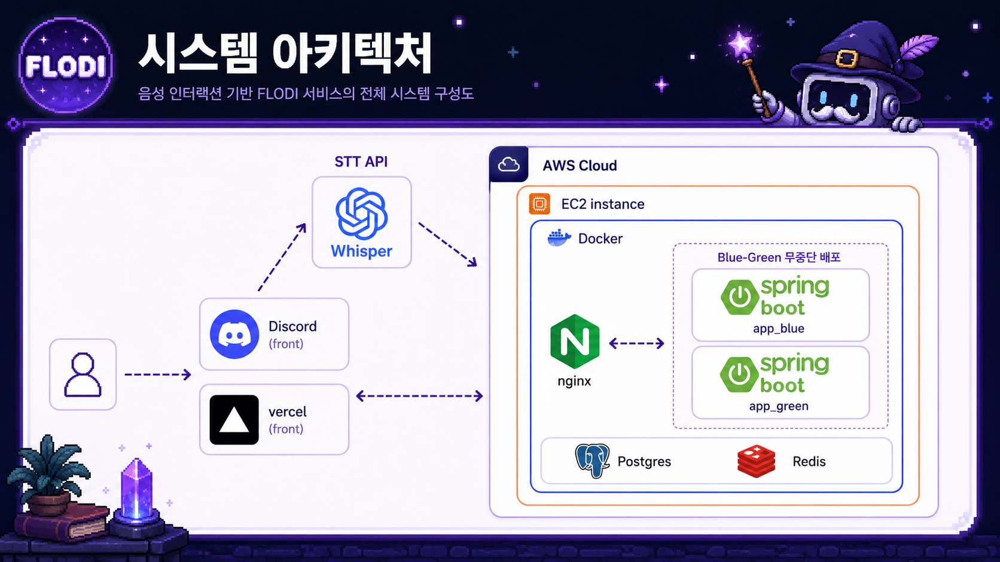
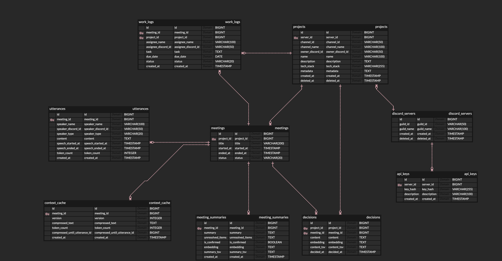

# Flodi Backend

> Discord 기반 AI 회의 도우미 - Spring Boot 백엔드

## 목차
- [프로젝트 소개](#프로젝트-소개)
- [주요 기능](#주요-기능)
- [기술 스택](#기술-스택)
- [시스템 아키텍처](#시스템-아키텍처)
- [ERD](#erd)
- [AI 활용](#ai-활용)
- [사용 방법](#사용-방법)
- [배포](#배포)
- [API 문서](#api-문서)
- [팀원](#팀원)

## 프로젝트 소개

Flodi는 AI를 활용하여 회의를 보조하는 Discord 봇 서비스입니다.
실시간으로 회의 맥락과 프로젝트 정보를 파악하고, 회의 중 질문에 맞는 답변을 제공하며, 회의 후 내용을 자동으로 분석 및 정리합니다.

## 주요 기능

| 기능 | 설명 |
|------|------|
| 실시간 자막 | Discord 음성 채널의 발화를 실시간으로 텍스트로 변환하여 자막 제공 |
| 회의 중 맥락 파악 | 발화가 쌓일수록 Rolling Summary로 회의 흐름을 지속적으로 압축·유지 |
| 컨텍스트 기반 AI 응답 | 호출어 감지 시 현재 회의 내용과 과거 회의 데이터를 기반으로 AI가 즉시 답변 |
| 회의 종료 후 자동 분석 | 회의 종료 시 전체 내용을 AI가 분석하여 요약, 결정사항, 액션 아이템 자동 추출 |
| 데이터 자산화 및 관리 | 회의 요약, 결정사항, 작업 로그를 프로젝트 단위로 누적 저장 및 벡터 검색 지원 |
| 웹 UI 제공 | 프로젝트, 회의, 결정사항을 웹 대시보드에서 조회하고 실시간 자막 확인 가능 |

## 기술 스택

### 프론트엔드
- TypeScript, React, Vite
- React Router DOM, TanStack Query (React Query), Fetch API
- Tailwind CSS v4, clsx, tailwind-merge, Lucide React
- STOMP.js (WebSocket 실시간 통신)
- ESLint, typescript-eslint

### 백엔드
- Java 25, Spring Boot 3.5.14
- Spring Web, Spring Data JPA, Spring Security, JWT, WebSocket, Validation
- PostgreSQL, pgvector, Redis, Flyway
- Gradle Kotlin DSL, JUnit, Testcontainers, ArchUnit, Spotless, Jacoco

### AI
- OpenAI Realtime API — Discord 음성 STT
- OpenAI Embedding `text-embedding-3-small` — 결정사항/회의 요약 임베딩
- OpenAI Chat 또는 GLM 5.1 — 회의 질의응답 및 요약

### 배포 및 CI/CD
- EC2, Docker, Docker Compose
- Nginx / Nginx Proxy Manager
- Blue-Green 배포 스크립트
- GitHub Actions (CI, Deploy, Release Please)
- PostgreSQL + pgvector, Redis 운영 구성

### 협업 도구
- Git / GitHub (ORG)
- Notion, Slack

## 시스템 아키텍처



## ERD



## AI 활용

### 1. 팀 공통 계층적 MD 문서 공유 및 CI 적용
- `AGENTS.md`, `ARCHITECTURE.md` 등 AI가 프로젝트를 스스로 파악할 수 있는 문서 체계 구축
- `exec-plans/`, `impl/` 등 작업 단계별 문서를 팀원 간 공유하며 AI 협업 일관성 유지
- AI가 생성한 구현 기록은 팀원 리뷰 후 승인하는 프로세스 적용
- CI에 문서 구조 검사 스크립트(`check-agent-docs.sh`) 연동하여 필수 문서 누락 시 PR 자동 차단

### 2. Whisper STT API
- OpenAI Realtime API를 활용해 Discord 음성을 실시간으로 텍스트 변환
- 참여자마다 독립 WebSocket 세션을 열어 동시 다중 발화 처리
- 중간 결과(partial)는 Discord 자막 및 웹 대시보드에 실시간 표시, 최종 결과(final)만 DB 저장

### 3. 회의 중 Rolling Summary
- 발화가 쌓일수록 AI가 이전 요약과 새 발화를 병합해 회의 흐름을 지속적으로 압축·유지
- 전체 발화를 그대로 저장하면 토큰 한계에 걸리는 문제를 해결
- 압축 실패 시 다음 발화 때 자동 재시도되어 회의 진행에 영향 없음

### 4. 회의 종료 후 자동 분석 및 정보 추출
- 회의 종료 시 전체 발화와 Rolling Summary를 AI에 전달해 회의 요약 생성
- 결정사항, 미결 사항, 액션 아이템을 구조화된 형태로 추출해 DB 저장
- 비동기로 실행되어 회의 종료 응답 속도에 영향 없음

### 5. 컨텍스트 기반 AI 질의응답 (RAG)
- 회의 중 호출어 감지 시 질문을 벡터화하고 pgvector로 과거 회의 요약과 결정사항을 유사도 검색
- 시맨틱 검색(70%)과 키워드 검색(30%)을 결합한 하이브리드 검색으로 관련 컨텍스트 추출
- 현재 회의 발화 + Rolling Summary + 과거 데이터를 합쳐 AI에 전달해 답변 생성
- 답변은 Discord 채널과 웹 대시보드에 동시 표시

## 사용 방법

### 1. 봇 초대
아래 링크로 Flodi 봇을 Discord 서버에 초대합니다.

[Flodi 봇 초대하기](https://discord.com/oauth2/authorize?client_id=1498144377405571242)

### 2. 대시보드 열기
Discord 채널에서 `!flodi` 를 입력하면 Flodi 대시보드 패널이 표시됩니다.

### 3. GUI 버튼으로 사용
대시보드 패널의 GUI 버튼으로 모든 기능을 사용할 수 있습니다.
- 프로젝트 생성
- 회의 시작 / 종료
- 회의 현황 확인

### 4. 웹 대시보드
대시보드 패널의 **웹 대시보드 열기** 버튼을 누르면 웹에서 프로젝트, 회의, 결정사항 등을 확인할 수 있습니다.

### 5. AI 질의응답
회의 중 음성으로 `AI야` 또는 `플로디야` 로 시작하는 질문을 하면, Flodi가 현재 회의 맥락과 프로젝트 정보를 기반으로 즉시 답변합니다.

## 배포

### 인프라 구성

| 구성 요소 | 설명 |
|-----------|------|
| EC2 | 애플리케이션 서버 |
| Docker / Docker Compose | 컨테이너 기반 실행 환경 |
| Nginx | 리버스 프록시 및 Blue-Green 트래픽 전환 |
| PostgreSQL + pgvector | 메인 데이터베이스 및 벡터 검색 |
| Redis | 실시간 자막 pub/sub |

### Blue-Green 무중단 배포

```
feature PR → dev → main
Release Please → chore(main): release x.y.z
GitHub Release published
→ GitHub Actions가 EC2에서 Blue-Green 배포 실행
```

- inactive 슬롯에 새 컨테이너 빌드 및 실행
- 헬스체크(`/actuator/health`) 통과 후 Nginx 트래픽 전환
- 이전 슬롯 종료

> 상세 배포 가이드: [docs/deployment/ec2-docker-compose.md](docs/deployment/ec2-docker-compose.md)

## API 문서

> [docs/references/internal-api-contracts.md](docs/references/internal-api-contracts.md)

## 팀원

| 이름 | 역할 |
|------|------|
| 원수연 | 팀장, 회의 후 분석 기능, 인증/인가 |
| 김경재 | 프로젝트 컨텍스트 설계, 질의응답 관련 임베딩 및 RAG |
| 송찬의 | Discord Bot 실시간 음성 파이프라인, 공통 AI MD 문서 구조 작성 |
| 복준호 | AI 질의응답 파이프라인 |
